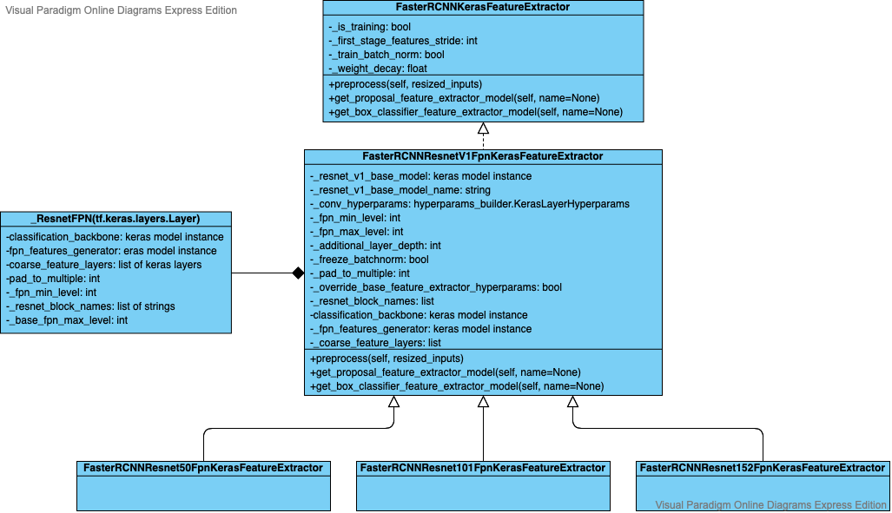

# GSOC 2020 Project

## Mentor

TF Model Garden: Jaeyoun Kim (jaeyounkim@)

Object Detection team: Vivek Rathod (rathodv@), Shan Yang (shanyang@) 

## Faster/Mask R-CNN FPN in Object Detection API
Learning Notes: [Object Detection API](od_notes/README.md)

### Goal

The original Faster/Mask R-CNN for object detection only uses the top layer feature map of the backbone. This feature map contains high semantic information but not much position information which makes the network having difficulties detecting small objects.

Thus we want to use feature maps that contain both high semantic information and position information. Thus we introduce feature pyramid network to our original Faster/Mask R-CNN architecture. Feature pyramid network uses feature maps from different layers of the backbone classifier and combined with upsampled top-down feature maps. It's a combination of layer with high semantics and layer with accurate position. Thus, it achieves high accuracy while having a reasonable running time.

The goal for this project is adding a Resnet FPN feature extractor for Faster/Mask RCNN. The work I have done including:
* Add Resnet V1 FPN feature extractor.
    * Add Resnet V1 FPN feature extractor that inherits the `FasterRCNNKerasFeatureExtractor` and returns a `keras.layers` that gives a inputs and outputs a list of features of different size.
    * Add feature extractor for `Resnet50`, `Resnet101`, `Resnet152`.
    * The class diagram for the Resnet FPN feature extractor is shown below. 

    
* Add multilevel crop and resize function.
    
    * Convert `matmul_crop_and_resize`, `native_crop_and_resize` function into multilevel crop and resize function.
* Modify faster RCNN meta architecture to accept multilevel features.
    
    * Originally faster RCNN meta architecture only accepts single feature from feature extractor. After modification, it now accepts a list of features from feature extractor.
* Modify proto files such that feature extractor can accept more args.
    
    * Feature pyramid network requires extra argument such as `fpn_min_level`, `fpn_max_level`, `pad_to_multiple`, and so on.
* Training and testing model using TPU(s) on COCO17 dataset. Due to limitation of TPU-32 usage, only models using input size 640x640 and with Resnet50 can be trained within a reasonable time. 


### Results

With Resnet50 as backbone, before adding FPN to the Faster RCNN , the model reaches mAP 29.3 on COCO17 dataset. After adding FPN to the Faster RCNN with Resnet50 as backbone, the model reached mAP 31.6. 

Tables below shows the Average Precision, Average Recall, and Loss on COCO17 dataset with an input image size of 640x640.

**<center>Table 1: Average Precision on COCO17 dataset</center>**

| IoU       | area   | maxDets | Average Precision |
| --------- | ------ | ------- | ----------------- |
| 0.50:0.95 | all    | 100     | 0.316             |
| 0.50      | all    | 100     | 0.551             |
| 0.75      | all    | 100     | 0.335             |
| 0.50:0.95 | small  | 100     | 0.107             |
| 0.50:0.95 | medium | 100     | 0.274             |
| 0.50:0.95 | large  | 100     | 0.457             |

**<center>Table 2: Average Recall on COCO17 dataset</center>**

| IoU       | area   | maxDets | Average Recall |
| --------- | ------ | ------- | -------------- |
| 0.50:0.95 | all    | 1       | 0.285          |
| 0.50:0.95 | all    | 10      | 0.458          |
| 0.50:0.95 | all    | 100     | 0.497          |
| 0.50:0.95 | small  | 100     | 0.269          |
| 0.50:0.95 | medium | 100     | 0.477          |
| 0.50:0.95 | large  | 100     | 0.641          |

**<center>Table 3: Loss on COCO17 dataset</center>**

| Type                                       | Loss      |
| ------------------------------------------ | --------- |
| Loss/RPNLoss/localization_loss             | 0.080119  |
| Loss/RPNLoss/objectness_loss               | 0.021327  |
| Loss/BoxClassifierLoss/localization_loss   | 0.272600  |
| Loss/BoxClassifierLoss/Classification_loss | 0.3121138 |
| Loss/regularization_loss                   | 0.271487  |
| Loss/total_loss                            | 0.954237  |

To reproduce this result, please follow the following instruction. (We need TPU access to train the model. Make sure you have access):

1. Follow the [instruction](https://github.com/tensorflow/models/blob/master/research/object_detection/g3doc/tf2.md). Install TensorFlow and Object Detection API.

2. Use config file: model/research/object_detection/configs/tf2/faster_rcnn_resnet50_v1_fpn_640x640_coco17_tpu-8.config

3. Train: 
```
USE_TPU=true
TPU_NAME=YOUR_TPU_NAME
MODEL_DIR=DIR_MODEL_STORED
PIPELINE_CONFIG_PATH=DIR_CONFIG_FILE
python3 object_detection/model_main_tf2.py \
    --pipeline_config_path=${PIPELINE_CONFIG_PATH} \
    --model_dir=${MODEL_DIR} \
    --use_tpu=${USE_TPU} \
    --tpu_name=${TPU_NAME} \
    --alsologtostderr
```

3. Eval:
```
python3 object_detection/model_main_tf2.py \
    --pipeline_config_path=${PIPELINE_CONFIG_PATH} \
    --model_dir=${MODEL_DIR} \
    --checkpoint_dir=${MODEL_DIR}  \
    --alsologtostderr
```

### Pull Request
The related pull request for this project is listed in the following table.

| Title                                                        | Link                                                         |
| ------------------------------------------------------------ | ------------------------------------------------------------ |
| Add Faster RCNN Resnet V1 FPN Keras feature extractor        | [#8716](https://github.com/tensorflow/models/pull/8716), [#8762](https://github.com/tensorflow/models/pull/8762) |
| Add multilevel crop and resize functions                     | [#8746](https://github.com/tensorflow/models/pull/8746)      |
| Move to keraslayers fasterrcnn fpn keras feature extractor   | [#8893](https://github.com/tensorflow/models/pull/8893)      |
| moving fpn message to fpn.proto                              | [#8894](https://github.com/tensorflow/models/pull/8894)      |
| Adjust frcnn meta arch to multilevel rpn feature             | [#8895](https://github.com/tensorflow/models/pull/8895)      |
| add config file for faster rcnn resnet 50 fpn on dataset coco17 using tpu-8 | [#9055](https://github.com/tensorflow/models/pull/9055)      |
| Add fpn to context rcnn                                      | [#9078](https://github.com/tensorflow/models/pull/9078)      |


## Community Support for TF2 Object Detection API (GitHub issues)
### Goal
Collect all issues (bugs, new features, docs) for Object Detection API since it upgraded to TF2 and help resolve Object Detection API issues. 

The issues that I have collected and help is listed in this [sheet](https://docs.google.com/spreadsheets/d/1q8t4TO455IWHbMsb9AKlsUxgogLwCqqhe73DXi82B8Y/edit?usp=sharing).

There are three parts in this sheet.
* Bug: Issues reported by users.
* Features: Possible future features collected by users. This is helpful reference for OD API about what our users are looking for.
* Documentation: Suggestion and documentation issues reported by users.

### Pull Request
The related pull request for this project is listed in the following table.

| Title                                                        | Link                                                    |
| ------------------------------------------------------------ | ------------------------------------------------------- |
| frozen inference graphs tf 1 documentation update            | [#8984](https://github.com/tensorflow/models/pull/8984) |
| remove unused import within image_resizer.proto              | [#8954](https://github.com/tensorflow/models/pull/8954) |
| fix links for research/object_detection/colab_tutorials/object_detection_tutorial.ipynb | [#8985](https://github.com/tensorflow/models/pull/8985) |
| fix object_detection_tutorial.ipynb instance segmentation example error | [#8978](https://github.com/tensorflow/models/pull/8978) |


## Panoptic Feature Pyramid Networks

### Goal

Implement CVPR 2019 paper - [Panoptic Feature Pyramid Networks](https://arxiv.org/abs/1901.02446). Panoptic segmentation is a combination of both instance segmentation and semantic segmentation. Panoptic FPN started with an FPN backbone which is wildly used to extract multilevel features and concatenate with two parallel branch. One uses Mask-RCNN for instance segmentation and the other uses a dense prediction branch for semantic segmentation.

### Current Progress
* Read paper and Detectron2 implementation for Panoptic Feature Pyramid Networks.
* Reading code in TensorFlow official computer vision modeling library.
* Waiting for updates in official library and will start implementing as soon as changes are released. Will continue working on this project in the following months.

## My Experience with GSoC

It is really a great experience this summer with GSoC. Many thanks to my mentor Jaeyoun Kim, Vivek Rathod, Shan Yang, and many others who helped me during this three months. This is my first time participating an open source project. I have learned a lot and received many advice from my mentors on the code structure and give my great guidance on how to contribute high-quality code to the community. They are super helpful and help me moving forward. After these three month, I get to know more about this wonderful community and become more familiar with the most popular AI framework around the world.


