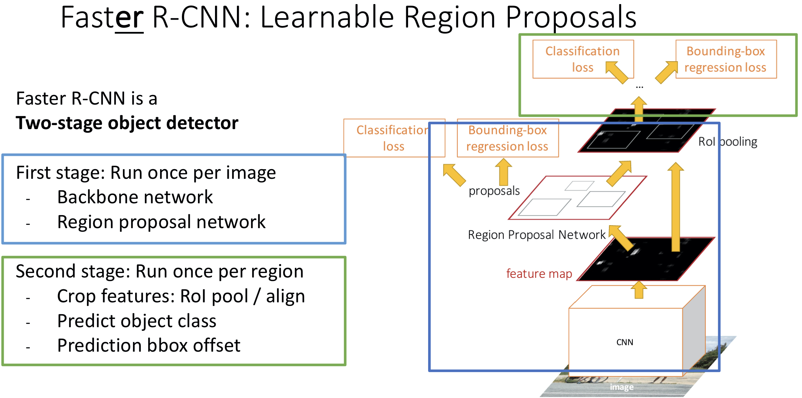
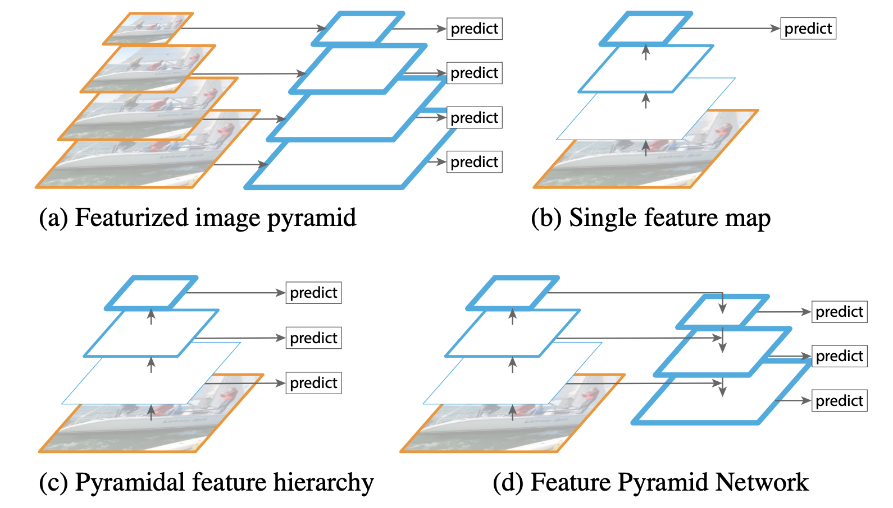
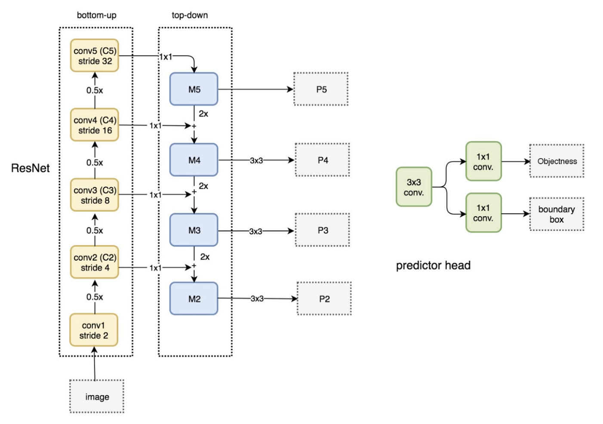

# GSoC 2020 - TenserFlow: Learning Notes

- Learn Google Cloud Platform
    - https://gcp-tutorial.readthedocs.io/en/latest/index.html
    - The restart command is different create command
    - Use version: tf nightly 
    - Don't delete VM
    - Remember to check TPU usage every night and remember to shut it down
        - Use command line to shutdown
        - Use automatica shutdown script
    - Test code using colab resources first, before using TPU resources on GCP
    - Set an alert for account!!!
- Use ReadtheDoc
- **GitHub / Stack Overflow support for Object Detection API**
- Documentation and Colab examples for computer vision (Details to be provided later)
- Blog post
- in July help testing some models


## June

### Task

####Object Detection API

#####Add FPN for Faster RCNN

######✅ June 9: Download dataset and try to train a dataset

-  ~~✅ <span style="color:red">When using runtime-version 1.12 encounter problem: tf.compat has no module v1</span>: Fixed using runtime version 1.15~~
- ❓ <span style="color:red">Cannot allocate memory at iteration 3 or 4</span>

######✅ June 10-19: try to implement FPN Feature Extractor

- ~~June 10: Find the entry point and setup implemetation plan~~

- ~~June 11: Exam on June 11 PST. Possible canceling thursday meeting?~~

- June 12-19: 

    - Discuss code structure. Follow code structure (below)

        - ```python
            # possible code structure
            # in models/faster_rcnn_fpn_keras_feature_extractor.py
            
            # No need to implement this function
            # Fpn_feature_levels (https://github.com/tensorflow/models/blob/master/research/object_detection/utils/ops.py#L1009)
            # def assign_feature_levels():
            #   # TODO: assignment strategy of region-based detectors
            #   # if the RoI’s scale becomes smaller, it should be mapped into a finer-resolution level
            #   # $$k=\lfloor k_0 + \log_2(\sqrt{wh}/224)\rfloor$$ 
            #   # input box size, k_0
            #   # output k
            #   pass
            
            class FasterRCNNFPNKerasFeatureExtractor(faster_rcnn_meta_arch.FasterRCNNKerasFeatureExtractor):
              def __init__(self, ...):
                # TODO: constructor
                pass
              
              def build(self, ...):
                # TODO: Build the structure, should be very similar as ssd_*_fpn_keras_feature_extractor.py
                # ResNet-101 (object_detection.models.keras_models)
                # object_detection.models.feature_map_generators
                pass
              
              def preprocess(self, ...):
                # TODO: should be the same as others
                pass
              
              def get_proposal_feature_extractor_model(self, name=None):
                """variable values"""
                # TODO: Extracts first stage RPN features
                # [x] assign_feature_levels() 
                # 	⬆️ Fpn_feature_levels 
                # [x] spatial_transform_ops.multilevel_roi_align
                # 	⬆️ is in faster rcnn meta arch
                #      @_compute_second_stage_input_feature_maps
                pass
              
              def _extract_box_classifier_features(self, ...):
                # TODO: Extracts second stage box classifier features.
                pass
              
              def restore_from_classification_checkpoint_fn(self, ...):
                # follow the none fpn version
                pass
                
            
            # predictor using convolutional keras box predictor
            ```

    - **Tips**:

        - target assignment need to adjust to multi feature (faster rcnn meta arch)
        - fork / open a pull request / push small piece

    - **Questions**:

        - ~~✅ <span style="color:red">Lisence？Should I just copy the lisency from another file? Is there anything else I need to do? Copy</span>~~

        - ~~✅ <span style="color:red">currently using resnet 50 in object_detection.models.keras_models: future wrtiting abstractions to extend to resnet101 and 152
            </span>~~

            -  ~~<span style="color:red">maybe make build abstractmethod and have another 3 class: FasterRCNNResnetV150(101/152)FPNKerasFeatureExtractor </span>~~

        - ❓ <span style="color:red">Which parameters we want to passed into the constructor</span>

            - eg. default_batchnorm_momentum,

            ​              default_batchnorm_epsilon,

            ​              weight_decay,

            ​       These will be handled in conv_hyperparameters.

            <span style="color:red">       Why min_depth and depth_multiplier not handled in conv_hyperparameters?</span>

            ​       ⬆️ depends on tenserflow 1 and 2. New example will be put on. (email)

        - ❓<span style="color:red">confused about weights and include_top. I didn't find how the mobilenet_v1.mobilenet_v1 use these args (From Keras?). How it connected to keras?</span>

            - <span style="color:red">weights: random initialization.</span>

            - <span style="color:red">include_top: wether to include the top fc layer.</span>

                ⬆️

        - ~~✅ <span style="color:red">self._depth_fn</span>~~

        - ~~✅<span style="color:red">def get_proposal_feature_extractor_model(self, name=None): from faster rcnn resnet keras feature extractor, only reture keras_model</span>~~

        - ❓ <span style="color:red">what does variable_dict do? (models/research/object_detection/models/faster_rcnn_resnet_keras_feature_extractor.py:129-130)</span>

        - ~~✅ <span style="color:red">model_util.extract_submodel (models/research/object_detection/models/faster_rcnn_resnet_keras_feature_extractor.py:170)</span>~~

        ```python
        full_mobilenet_v1 = mobilenet_v1.mobilenet_v1(
                batchnorm_training=(self._is_training and not self._freeze_batchnorm),
                conv_hyperparams=(self._conv_hyperparams
                                  if self._override_base_feature_extractor_hyperparams
                                  else None),
                weights=None,
                use_explicit_padding=self._use_explicit_padding,
                alpha=self._depth_multiplier,
                min_depth=self._min_depth,
                conv_defs=self._conv_defs,
                include_top=False)
        ```

        - unit test and check using small images 2\*40\*40\*3
            - **update**: the size of images has to be able to devide 32

    - test every step

    

    **Pull request: [Add Faster RCNN Resnet V1 FPN Keras feature extractor](https://github.com/tensorflow/models/pull/8716)**


######✅ June 22 - 24: Add multilevel crop and resize fn

- Questions:

    - ? image_ratio: A float indicating the ratio of input image area to pretraining

    ​      image area. fpn_feature_levels(num_levels, unit_scale_index, image_ratio, boxes):

    

    **Pull request: [Add multilevel crop and resize functions](https://github.com/tensorflow/models/pull/8746)**


######June 24 - 25, 29: modify meta arch:

- functions modified due to multilevel crop and resize functions:

    - ``````python
        def _compute_second_stage_input_feature_maps(self, features_to_crop,
                                                       proposal_boxes_normalized,
                                                       **side_inputs)
          # change rpn_features_to_crop into a list
          # change rpn_box_predictor_features into a list (corresponding to rpn_features_to_crop)
        ``````

- Compare two possible solutions for supporting multilevel features: 5D tensor vs. list of 4D tensor

    self._extract_proposal_features for fpn will return a list of 4D tensors.

    | function                                        | things need to be change (Notation: *returned*, **function**) |
    | ----------------------------------------------- | ------------------------------------------------------------ |
    | _extract_rpn_feature_maps                       | *rpn_features_to_crop*<br />*rpn_box_predictor_features*<br />*anchors* |
    | _predict_first_stage                            | from _extract_rpn_feature_maps：<br />- rpn_box_predictor_features<br />- rpn_features_to_crop<br />- anchors_boxlist<br />**\_predict_rpn_proposals(rpn_box_predictor_features)**<br />**box_list_ops.clip_to_window(anchors_boxlist)<br />\_remove_invalid_anchors_and_predictions(rpn_box_encodings, rpn_objectness_predictions_with_background)** |
    | _predict_rpn_proposals                          | Input: rpn_box_predictor_features<br />- **self.\_first_stage_box_predictor(rpn_box_predictor_features)**<br />- **self.\_first_stage_box_predictor.predict(rpn_box_predictor_features)**<br />Return: box_predictions (contain 2 lists)<br />*box_encodings*<br />*objectness_predictions_with_background* |
    | \_first_stage_box_predictor<br /> (keras model) | box_predictor_builder.build_convolutional_box_predictor(<list>)<br />??? since the output list is corresponding to each input features. is the k_0 needs to be varied for different input feature???<br />Possible place of combine all |
    | \_first_stage_box_predictor.predict             | box_predictor.predict(<list>)                                |
    | predict                                         | **self._predict_second_stage()**<br />**self._predict_third_stage()**<br />*prediction_dict* |
    | postprocess                                     | use prediction dict<br />**\_add_detection_features_output_node()**<br />**\_postprocess_rpn()** |
    | \_postprocess_rpn                               | **\_batch_decode_boxes**                                     |
    | loss                                            | use prediction dict                                          |
    | \_loss_rpn                                      |                                                              |
    | _predict_second_stage                           | use \_box_prediction (returns prediction dict)               |
    | \_predict_third_stage                           | in none training mode use prediction_dict['rpn_features_to_crop'] |
    | \_box_prediction                                | use \_compute_second_stage_input_feature_maps at the beginning |
    | \_add_detection_features_output_node            | use \_compute_second_stage_input_feature_maps at the beginning |
    |                                                 |                                                              |

    it should end at the _compute_second_stage_input_feature_maps

    |      | 5D Tensor                                                    | List of 4D Tensors                                           |
    | ---- | ------------------------------------------------------------ | ------------------------------------------------------------ |
    | pro  | If we find find a good place to combine results for all levels. Then all the functions of the following steps doesn't need to be modified. (same for 5D tensor) | in lots of box methods: rpn_features_to_crop is already a list of 4D tensors <br />sometimes don't need to modify a function, just need to wrap it inside of a for loop<br />If we find find a good place to combine results for all levels. Then all the functions of the following steps doesn't need to be modified. (same for 5D tensor) |
    | con  | Might need to go through the functions and models to see if actually gives us the correct result.<br />Need to take care of crop and resize | Going through loops is not efficient as 5D tensors           |


- setup training loop: overfit on small data
- test

- Move all our existing feature extractors to Keras
- Add Precision/Recall as an eval metric (https://github.com/tensorflow/models/issues/8412)


---


### FPN: Feature Pyramid Networks for Object Detection

##### Why use FPN?

- The Faster RCNN I learned before only uses the feature comming out from the backbone network. This featurn map contains high semantic information but not much position information. This makes the network having difficulties detecting small objects.

    

    


##### FPN idea



*Figure 1. (a) Using an image pyramid to build a feature pyramid. Features are computed on each of the image scales independently, which is slow. (b) Recent detection systems have opted to use only single scale features for faster detection. (c) An alternative is to reuse the pyramidal feature hierarchy computed by a ConvNet as if it were a featurized image pyramid. (d) Our proposed Feature Pyramid Network (FPN) is fast like (b) and (c), but more accurate. In this figure, feature maps are indicate by blue outlines and thicker outlines denote semantically stronger features.*

- My understanding: It's a combination of layer with high semantics and layer with accurate position. Thus, it achieves high accuracy while having a resonable running time.


##### FPN Structure



##### For Faster RCNN: assign RoI of different scales to the pyramid levels

Assign an RoI of width $w$ and height $h$ (on the input image to the network) to the level $P_k$ of feature pyramid by:

$$k=\lfloor k_0 + \log_2(\sqrt{wh}/224)\rfloor$$

Here 224 is the canonical ImageNet pre-training size, and $k_0$ is the target level on which an RoI with $w×h = 224^2$ should be mapped into.


---


### Object Detection API

#### Meta Architectures

- Detection Model Interface: core/model.py:
    - tensor-in / tensor-out design
    - computation graphs
        - Training time:
            inputs (images tensor) -> preprocess -> predict -> loss -> outputs (loss tensor)
        - Evaluation time:
            inputs (images tensor) -> preprocess -> predict -> postprocess
             -> outputs (boxes tensor, scores tensor, classes tensor, num_detections tensor)
    - Notes:
        - standard_fields: naming convention
        - DetectionModel: a class containing many abstact methods.
            - get_side_inputs (static): 
            - preprocess: 
                - scaling, shifting, resizing, padding
                - no trainable parameters
                - batchsize != batchsize in predict (assuming 1)
                - return processed image and original shape
                -  <font color='red'>There is also no explicit assumption that the output resolutions must be fixed across inputs --- this is to support *"fully convolutional" settings* in which input images can have different shapes/resolutions. ??? fully convolutional neural network</font>
            - predict:
                - input processed image and original shape
                - output prediction
            - postprocess:
                - get final detection
                - NMS / convert score / remove backgroud class
                - Output
                    - Class: [0, num_classes)
                    - Boxes: [y_min, x_min, y_max, x_max]
                    - detections can pad into fixed number of boxes
                    - <font color='red'>What is keypoints?</font>
            - loss:
                - need group truth
            - provide_groundtruth:
                - add groudtruth
                    - boxes and classes ground truth
            - regularization_losses:
            - restore_map:
                - restore from check point
            - updates:
                - <font color='red'>Which operators...?</font>
                    - meta 里面有没有update / not used in TF2
            - call:
                - connect all steps


#### Code Pointers

##### Data pipeline

- inputs.py
    - train_input:
        - output features and labels
        - data_augmentation
        - image_resizer
        - transform_input_data: use data_augmentation & image_resizer
        - pad_input_data_to_static_shapes: use transform_input_data
        - INPUT_BUILDER_UTIL_MAP['dataset_build']: use pad_input_data_to_static_shapes

#####  Reader

- core/data_decoder.py:
    - DataDecoder (abstract):
        - return dictionary associate image and labels.

##### Data Augmenter

- core/preprocessor.py:

    - preprocess

        - input tensor, list of tuple (function, dict of args), map function with args, cache (deterministic using same cache).

        

#### Target Assignment

- target_assigner.py:
    - compute similarity
    - compute matching
    - assign regression targets: use matching, BoxCoder
    - assign classification targets: use matching
    - one image a time
- core/matcher.py
- core/region_similarity_calculator.py
- core/boxCoder


#### Prediction

##### Feature Extractor

- meta_architectures/faster_rcnn_meta_arch.py:
    - three modes: number of stages different {1, 2, 3}
        - 1 stage: only RPN
        - 2 stages: proposals -> box classifier
        - 3 stages: eval: proposals -> box classifier -> NMS -> box classifier
    - functions overide:
        - preprocess
        - _extract_proposal_features
        - _extract_box_classifier_features

##### Head

- predictors/heads/head.py:
    - head class
    - overide predict
    - add to meta structure
    - compute loss
    - (optional) visualization

##### Box Predictor

- core/box_predictor.py：
    - passed directly to loss functions
    - predict location, predict class

##### Anchor Generator

- core/anchor_generator.py
    - create (or load) a collection of bounding boxes


